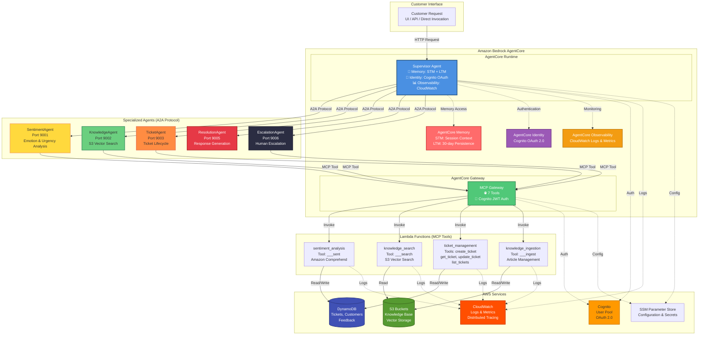

# Multi-Agent Customer Support Platform

A production-ready, intelligent customer support system built with **Amazon Bedrock AgentCore** and **AWS Strands Agents**. The platform uses a sophisticated multi-agent architecture where specialized AI agents collaborate via the A2A (Agent-to-Agent) protocol to deliver personalized, context-aware customer support.

## The Solution

Instead of building another rigid support system, we created a team of AI specialists that work together like an expert customer support team:



## 🏗️ Architecture Overview

### Amazon Bedrock AgentCore Features

This system leverages **5 core AgentCore services**:

1. **AgentCore Runtime** ⚙️
   - Hosts the Supervisor Agent in a managed container environment
   - Provides HTTP endpoint (`/invocations`) for agent invocations
   - Automatic scaling, session management, and lifecycle handling
   - Network configuration: Public access with HTTP protocol
   - Observability: Enabled for CloudWatch logs and metrics

2. **AgentCore Memory** 🧠
   - **Mode**: `STM_AND_LTM` (Short-Term + Long-Term Memory)
   - **STM (Short-Term Memory)**: Session-level context, cleared when session ends
   - **LTM (Long-Term Memory)**: Persistent user context across sessions
   - **Expiry**: 30 days for LTM events
   - **Memory ID**: `customer_support_supervisor_mem-SalHj92SVh`
   - Automatic memory management via `user_id` for cross-session persistence

3. **AgentCore Gateway** 🌐
   - **Protocol**: MCP (Model Context Protocol)
   - **Purpose**: Exposes AWS Lambda functions as MCP tools for agents
   - **Authentication**: Cognito JWT (OAuth 2.0) with custom JWT authorizer
   - **Gateway Targets**: 7 tools across 4 Lambda functions
     - `sentiment_analysis` → `___sent` tool
     - `knowledge_search` → `___search` tool
     - `knowledge_ingestion` → `___ingest` tool
     - `ticket_management` → 4 tools: `create_ticket`, `get_ticket`, `update_ticket`, `list_tickets`
   - **Credential Provider**: Gateway IAM role for Lambda invocation

4. **AgentCore Identity** 🔐
   - **Provider**: Amazon Cognito (OAuth 2.0)
   - **Authentication**: OAuth with JWT tokens
   - **Scopes**: `openid`, `email`, `profile`
   - **Discovery URL**: Cognito OpenID Connect discovery endpoint
   - **Client ID**: Cognito User Pool client ID
   - **Integration**: Runtime uses Cognito for user authentication and authorization

5. **AgentCore Observability** 📊
   - **Status**: Enabled
   - **Logging**: CloudWatch Logs integration
   - **Metrics**: Runtime performance and invocation metrics
   - **Tracing**: Distributed tracing support
   - **Monitoring**: Real-time agent status and health checks

### Core Components
- **AgentCore Runtime** - Supervisor agent with memory and identity
- **A2A Protocol** - Agent-to-agent communication (Strands Agents)
- **MCP Gateway** - Lambda function integration via AgentCore Gateway
- **Bedrock Models** - Configurable AI models (default: Claude Haiku)
- **S3 Vector Storage** - Knowledge base with embeddings
- **Cognito Authentication** - OAuth and JWT support (integrated with AgentCore Identity)
- **Lambda Functions** - Sentiment analysis, knowledge search, ticket management

### Multi-Agent System Architecture

```
┌─────────────────────────────────────────────────────────────────────────┐
│                         Customer Request                                 │
│                    (UI / API / Direct Invocation)                        │
└──────────────────────────────┬──────────────────────────────────────────┘
                               │
                               ▼
┌─────────────────────────────────────────────────────────────────────────┐
│              AgentCore Runtime (Supervisor Agent)                        │
│  ┌──────────────────────────────────────────────────────────────────┐   │
│  │ • BedrockAgentCoreApp (HTTP endpoint: /invocations)             │   │
│  │ • Memory: STM_AND_LTM (30-day LTM expiry)                       │   │
│  │ • Identity: Cognito OAuth 2.0                                    │   │
│  │ • Observability: CloudWatch logs & metrics                        │   │
│  └──────────────────────────────────────────────────────────────────┘   │
└──────────────────────────────┬──────────────────────────────────────────┘
                               │
                               │ A2A Protocol (Agent-to-Agent)
                               │
        ┌──────────────────────┼──────────────────────┐
        │                      │                      │
        ▼                      ▼                      ▼
┌───────────────┐    ┌───────────────┐    ┌───────────────┐
│ SentimentAgent│    │KnowledgeAgent  │    │  TicketAgent  │
│  (Port 9001)  │    │  (Port 9002)  │    │  (Port 9003)  │
│               │    │               │    │               │
│ • Emotion     │    │ • S3 Vector   │    │ • CRUD Ops    │
│ • Urgency     │    │ • Search      │    │ • Lifecycle   │
└───────┬───────┘    └───────┬───────┘    └───────┬───────┘
        │                    │                    │
        ▼                    ▼                    ▼
┌───────────────┐    ┌───────────────┐    ┌───────────────┐
│ResolutionAgent│    │EscalationAgent │    │  (Future)     │
│  (Port 9005)  │    │  (Port 9006)  │    │               │
│               │    │               │    │               │
│ • Responses  │    │ • Escalation  │    │               │
└───────┬───────┘    └───────┬───────┘    └───────────────┘
        │                    │
        └────────────────────┘
                    │
                    ▼
┌─────────────────────────────────────────────────────────────────────────┐
│                    AgentCore Gateway (MCP Protocol)                     │
│  ┌──────────────────────────────────────────────────────────────────┐  │
│  │ • Authentication: Cognito JWT (OAuth 2.0)                         │  │
│  │ • Protocol: MCP (Model Context Protocol)                          │  │
│  │ • Gateway Targets: 7 tools across 4 Lambda functions             │  │
│  └──────────────────────────────────────────────────────────────────┘  │
└──────────────────────────────┬──────────────────────────────────────────┘
                               │
                               │ MCP Tool Invocation
                               │
        ┌──────────────────────┼──────────────────────┐
        │                      │                      │
        ▼                      ▼                      ▼
┌───────────────┐    ┌───────────────┐    ┌───────────────┐
│ sentiment_    │    │ knowledge_    │    │ ticket_       │
│ analysis      │    │ search        │    │ management    │
│               │    │               │    │               │
│ Tool: ___sent │    │ Tool: ___search│   │ Tools:        │
│               │    │               │    │ • create_ticket│
│ • Comprehend  │    │ • S3 Vector   │    │ • get_ticket  │
│ • Sentiment   │    │ • Embeddings  │    │ • update_ticket│
└───────┬───────┘    └───────┬───────┘    │ • list_tickets│
        │                    │            └───────┬───────┘
        │                    │                    │
        └────────────────────┼────────────────────┘
                             │
                             ▼
┌─────────────────────────────────────────────────────────────────────────┐
│                         AWS Services                                    │
│  ┌──────────────────────────────────────────────────────────────────┐  │
│  │ • DynamoDB: tickets, customers, feedback tables                   │  │
│  │ • S3: Knowledge base storage, vector embeddings                   │  │
│  │ • Cognito: User authentication & authorization                     │  │
│  │ • CloudWatch: Logs, metrics, observability                       │  │
│  │ • SSM Parameter Store: Configuration & secrets                    │  │
│  └──────────────────────────────────────────────────────────────────┘  │
└─────────────────────────────────────────────────────────────────────────┘
```

### Infrastructure Components

**AgentCore Services:**
- **Runtime**: Containerized Supervisor Agent with HTTP endpoint
- **Memory**: STM_AND_LTM memory instance (Memory ID: `customer_support_supervisor_mem-SalHj92SVh`)
- **Gateway**: MCP Gateway with Cognito JWT authentication
- **Identity**: Cognito OAuth 2.0 integration
- **Observability**: CloudWatch integration enabled

**AWS Infrastructure:**
- **DynamoDB**: 3 tables (tickets, customers, feedback)
- **S3**: 2 buckets (knowledge base, vector storage)
- **Lambda**: 4 functions (sentiment_analysis, knowledge_search, ticket_management, knowledge_ingestion)
- **Cognito**: User Pool with OAuth 2.0, JWT support, M2M client
- **IAM**: Execution roles, Gateway roles, Lambda permissions
- **SSM Parameter Store**: Gateway URL, Cognito credentials, configuration
- **ECR**: Container registry for AgentCore Runtime images
- **CloudWatch**: Logs, metrics, and distributed tracing

## 🚀 Quick Start for New Developers

Get the system up and running in 5 simple steps:

### Prerequisites

1. **AWS CLI** configured with appropriate permissions
2. **Terraform** installed (>= 1.0)
3. **Python 3.11+** with virtual environment support
4. **AgentCore CLI** installed (`pip install bedrock-agentcore-starter-toolkit`)

### Step 1: Clone and Setup

```bash
# Clone the repository
git clone <repository-url>
cd multi-agent-customer-support

# Run the main setup script (creates venv, installs dependencies, creates .env)
./setup.sh

# Activate virtual environment
source venv/bin/activate
```

**What `setup.sh` does:**
- ✅ Checks prerequisites (Python, AWS CLI, Terraform, AgentCore CLI)
- ✅ Creates virtual environment
- ✅ Installs all Python dependencies
- ✅ Creates `.env` file with defaults

### Step 2: Configure AWS Credentials

```bash
# Configure AWS credentials (if not already done)
aws configure

# Enter your:
# - AWS Access Key ID
# - AWS Secret Access Key
# - Default region (e.g., us-east-1)
# - Default output format (json)
```

### Step 3: Deploy Infrastructure

```bash
# Navigate to infrastructure directory
cd infrastructure/minimal

# Initialize Terraform
terraform init

# Review what will be created
terraform plan

# Deploy infrastructure
terraform apply

# Return to project root
cd ../..
```

**What gets deployed:**

**AWS Infrastructure:**
- **DynamoDB Tables**: `tickets`, `customers`, `feedback`
- **S3 Buckets**: Knowledge base storage, vector embeddings storage
- **Lambda Functions**: 
  - `sentiment_analysis` - Amazon Comprehend integration
  - `knowledge_search` - S3 Vector search
  - `ticket_management` - CRUD operations (4 tools: create, get, update, list)
  - `knowledge_ingestion` - Article management (admin)
- **Cognito User Pool**: OAuth 2.0 authentication with JWT support
- **IAM Roles & Policies**: Execution roles, Gateway roles, Lambda permissions
- **SSM Parameter Store**: Gateway URL, Cognito credentials, configuration

**AgentCore Resources:**
- **AgentCore Runtime**: Supervisor agent deployment
- **AgentCore Memory**: STM_AND_LTM memory instance
- **AgentCore Gateway**: MCP Gateway with 7 tool targets
- **AgentCore Identity**: Cognito OAuth integration
- **ECR Repository**: Container image storage for Runtime

### Step 4: Update Configuration and Initialize Knowledge Base

```bash
# Update .env file with Terraform outputs
./scripts/setup/update_env.sh

# Initialize S3 Vector knowledge base with sample articles
python scripts/deploy/initialize_s3_vectors.py
```

**What these scripts do:**
- `update_env.sh`: Reads Terraform outputs and updates `.env` file
- `initialize_s3_vectors.py`: Creates S3 Vector indexes and ingests sample articles

### Step 5: Deploy AgentCore

```bash
# Deploy the supervisor agent to AgentCore Runtime
./scripts/deploy/deploy_agentcore.sh

# Verify deployment
agentcore status
```

**What gets deployed:**
- **AgentCore Runtime**: Supervisor agent containerized deployment
- **Memory**: STM_AND_LTM memory instance (30-day LTM expiry)
- **HTTP Endpoint**: `/invocations` endpoint for agent invocations
- **Session Management**: Automatic via `runtimeSessionId` (33+ character UUIDs)
- **MCP Tools Integration**: 7 tools via AgentCore Gateway
- **Identity**: Cognito OAuth 2.0 authentication
- **Observability**: CloudWatch logs and metrics enabled

### Step 6: Test the System

```bash
# Test with a simple invocation
agentcore invoke '{"prompt": "How do I reset my password?", "session_id": "test-001"}'

# Or use the test scripts
./tests/test_all_agents.sh
```

## 📋 Quick Reference

**Setup (first time):**
```bash
./setup.sh                    # Initial setup
aws configure                 # Configure AWS credentials
cd infrastructure/minimal && terraform apply  # Deploy infrastructure
./scripts/setup/update_env.sh # Update configuration
python scripts/deploy/initialize_s3_vectors.py  # Initialize knowledge base
./scripts/deploy/deploy_agentcore.sh  # Deploy AgentCore
```

**Daily development:**
```bash
source venv/bin/activate      # Activate virtual environment
./scripts/deploy/start_dev.sh  # Start local development server
# OR
agentcore dev                  # Direct AgentCore dev command
```

**Running the UI:**
```bash
source venv/bin/activate
streamlit run ui/ui.py         # Start Streamlit UI
```

**Testing:**
```bash
./tests/test_all_agents.sh    # Test all agents
python tests/test_session_memory_complete.py  # Test memory
```

## 📁 Project Structure

```
multi-agent-customer-support/
├── setup.sh                  # Main setup script (run this first!)
├── Dockerfile                 # AgentCore deployment (supervisor + agents in same container)
├── agent.py                   # Supervisor agent entry point
├── requirements.txt           # All Python dependencies (UI included)
├── scripts/
│   ├── setup/                # Configuration scripts
│   │   ├── update_env.sh     # Update .env from Terraform
│   │   └── setup_venv.sh     # Virtual environment setup
│   └── deploy/               # Deployment scripts
│       ├── deploy_agentcore.sh
│       ├── start_dev.sh      # Start AgentCore dev server
│       ├── initialize_s3_vectors.py
│       └── manage_knowledge_base.py
├── tests/                    # Test scripts
│   ├── test_all_agents.sh
│   ├── test_session_memory_complete.py
│   └── check_bedrock_access.py
├── ui/                       # UI application
│   └── ui.py                 # Main Streamlit UI with authentication
├── infrastructure/           # Terraform infrastructure
├── agents/                   # Agent implementations
├── lambda/                   # Lambda functions
└── README.md                 # This file
```

See `scripts/README.md` and `tests/README.md` for detailed documentation.

## 🔧 Configuration

### Environment Variables (.env)

```bash
# AWS Configuration
AWS_REGION=us-east-1
BEDROCK_MODEL_ID=anthropic.claude-3-haiku-20240307-v1:0

# Agent URLs (for local development)
SENTIMENT_AGENT_URL=http://127.0.0.1:9001
KNOWLEDGE_AGENT_URL=http://127.0.0.1:9002
TICKET_AGENT_URL=http://127.0.0.1:9003
RESOLUTION_AGENT_URL=http://127.0.0.1:9005
ESCALATION_AGENT_URL=http://127.0.0.1:9006

# AgentCore Gateway (automatically configured via Parameter Store)
# For local dev only - cloud deployments read from Parameter Store automatically
# AGENTCORE_GATEWAY_URL=https://your-gateway-url.amazonaws.com  # Optional for local dev

# Cognito (from Terraform outputs)
COGNITO_USER_POOL_ID=us-east-1_xxxxx
COGNITO_CLIENT_ID=xxxxx
COGNITO_DOMAIN=your-domain.auth.us-east-1.amazoncognito.com

# DynamoDB Tables (from Terraform outputs)
TICKETS_TABLE=dev-customer-support-tickets
CUSTOMERS_TABLE=dev-customer-support-customers
FEEDBACK_TABLE=dev-customer-support-feedback

# S3 Buckets (from Terraform outputs)
KNOWLEDGE_BASE_BUCKET=dev-customer-support-knowledge-base
VECTOR_BUCKET_NAME=dev-customer-support-vectors
```

### Terraform Variables (terraform.tfvars)

```hcl
aws_region = "us-east-1"
environment = "dev"
project_name = "customer-support"
admin_email = "your-admin@company.com"
```

## 🤖 Agent Architecture

### **Supervisor Agent** (AgentCore Runtime)
- **File**: `agent.py`
- **Role**: Central orchestrator and entry point
- **Features**: Memory persistence, A2A coordination, MCP integration
- **Endpoint**: `/invocations` (HTTP)
- **Session Management**: Automatic via `runtimeSessionId`

### **Specialized Agents** (A2A Servers)
1. **SentimentAgent** (Port 9001) - Emotion analysis & escalation
2. **KnowledgeAgent** (Port 9002) - S3 vector search & solutions  
3. **TicketAgent** (Port 9003) - Complete ticket lifecycle
4. **ResolutionAgent** (Port 9005) - Personalized response generation
5. **EscalationAgent** (Port 9006) - Human-in-the-loop escalation


See [agents/README.md](agents/README.md) for complete agent documentation.

## 📚 Request Formats

The agent supports **both** standard HTTP agent format and extended format for maximum compatibility.

### Standard HTTP Format (Recommended)

```bash
curl -X POST http://localhost:8081/invocations \
  -H "Content-Type: application/json" \
  -d '{
    "prompt": "user question",
    "session_id": "your-session-id"
  }'
```

**Fields:**
- `prompt` (required): The user's question or prompt
- `session_id` (optional): Session identifier for conversation continuity

### Extended Format

For more advanced use cases with additional context:

```bash
curl -X POST http://localhost:8081/invocations \
  -H "Content-Type: application/json" \
  -d '{
    "question": "user question",
    "context": {
      "runtimeSessionId": "session-id-from-agentcore",
      "user_id": "user123",
      "conversation_history": [
        {"role": "user", "content": "Previous question"},
        {"role": "assistant", "content": "Previous response"}
      ]
    }
  }'
```

**Fields:**
- `question` (required): The user's question
- `context` (optional): Additional context object
  - `user_id`: User identifier for LTM
  - `runtimeSessionId`: AgentCore session ID (33+ characters)
  - `conversation_history`: Previous messages in the session

## 🧠 AgentCore Memory Architecture

The system uses **AgentCore Memory Service** with **STM_AND_LTM** mode for comprehensive memory management.

### Memory Types

**STM (Short-Term Memory):**
- **Scope**: Session-level conversation context
- **Lifecycle**: Cleared when session ends (15 min idle timeout, 8 hours max lifetime)
- **Storage**: Managed by AgentCore Runtime per `runtimeSessionId`
- **Use Case**: Current conversation flow, immediate context
- **Access**: Automatic via `conversation_history` in context

**LTM (Long-Term Memory):**
- **Scope**: Persistent user context across sessions
- **Lifecycle**: 30-day expiry (configurable via `event_expiry_days`)
- **Storage**: Managed by AgentCore Memory Service, keyed by `user_id`
- **Use Case**: User preferences, past interactions, cross-session continuity
- **Access**: Automatic retrieval via `MemoryClient.get_last_k_turns()` and `retrieve_memories()`
- **Memory ID**: `customer_support_supervisor_mem-SalHj92SVh`

### Memory Flow

```
User Request (with user_id)
    ↓
AgentCore Runtime
    ↓
┌─────────────────────────────────────┐
│ 1. Check STM (current session)      │
│ 2. If not found, check LTM (user)  │
│ 3. Inject memory into prompt        │
│ 4. Agent processes with context     │
│ 5. Store new info in STM + LTM      │
└─────────────────────────────────────┘
    ↓
Response with context awareness
```

### Memory Implementation

- **Automatic STM**: AgentCore Runtime manages STM per session automatically
- **Explicit LTM Retrieval**: Supervisor Agent uses `MemoryClient` to fetch LTM when needed
- **Cross-Session Persistence**: Same `user_id` across different `runtimeSessionId` values maintains LTM

### Testing Memory

```bash
SESSION_ID="my-session-123"

# First message (establishes context)
curl -X POST http://localhost:8081/invocations \
  -H "Content-Type: application/json" \
  -d "{
    \"prompt\": \"My name is John and I need help with password reset\",
    \"session_id\": \"$SESSION_ID\"
  }"

# Follow-up (remembers context)
curl -X POST http://localhost:8081/invocations \
  -H "Content-Type: application/json" \
  -d "{
    \"prompt\": \"What was my issue?\",
    \"session_id\": \"$SESSION_ID\"
  }"

# Cross-session (LTM - different session, same user_id)
curl -X POST http://localhost:8081/invocations \
  -H "Content-Type: application/json" \
  -d "{
    \"prompt\": \"What did I tell you before?\",
    \"context\": {
      \"user_id\": \"user123\",
      \"runtimeSessionId\": \"new-session-456\"
    }
  }"
```

**Note**: Session IDs must be **33+ characters** (AgentCore requirement). Use UUIDs for session IDs.

## 🛠️ Development

### Local Development

```bash
# Run supervisor locally (specialized agents start automatically in background threads)
agentcore dev --port 8081

# Test the system
python tests/test_session_memory_complete.py
```

### Testing Examples

**Test Knowledge Agent:**
```bash
curl -X POST http://localhost:8081/invocations \
  -H "Content-Type: application/json" \
  -d '{"prompt": "How do I reset my password?", "session_id": "test-001"}'
```

**Test Sentiment Analysis:**
```bash
curl -X POST http://localhost:8081/invocations \
  -H "Content-Type: application/json" \
  -d '{"prompt": "I am very frustrated!", "session_id": "test-002"}'
```

**Test Ticket Creation:**
```bash
curl -X POST http://localhost:8081/invocations \
  -H "Content-Type: application/json" \
  -d '{"prompt": "Create a ticket for billing issue", "session_id": "test-003"}'
```

**Test Memory (STM):**
```bash
# First message
curl -X POST http://localhost:8081/invocations \
  -H "Content-Type: application/json" \
  -d '{"prompt": "My name is John", "session_id": "memory-test-001"}'

# Follow-up (should remember name)
curl -X POST http://localhost:8081/invocations \
  -H "Content-Type: application/json" \
  -d '{"prompt": "What is my name?", "session_id": "memory-test-001"}'
```

## 📊 Monitoring & Observability

### AgentCore Observability

**Status**: Enabled in AgentCore Runtime configuration

```bash
# Check agent status
agentcore status

# View logs
agentcore logs

# Monitor in real-time
agentcore dev --verbose
```

**Observability Features:**
- **CloudWatch Logs**: Runtime logs, agent invocations, errors
- **CloudWatch Metrics**: Invocation count, latency, success rate
- **Distributed Tracing**: X-Ray integration for end-to-end tracing
- **Health Checks**: Runtime health and agent availability

### AWS Resources Monitoring

- **CloudWatch**: Logs and metrics for all services
- **X-Ray**: Distributed tracing across Lambda, Gateway, Runtime
- **Lambda**: Function monitoring (invocations, errors, duration)
- **S3**: Storage metrics (bucket size, request counts)
- **DynamoDB**: Table metrics (read/write capacity, throttling)
- **Cognito**: Authentication metrics (sign-ins, token requests)

## 🏗️ Complete Infrastructure Details

### AgentCore Resources

| Service | Resource | Configuration |
|---------|----------|---------------|
| **Runtime** | `customer_support_supervisor-GIa7fv2B6G` | Container, HTTP protocol, Public network |
| **Memory** | `customer_support_supervisor_mem-SalHj92SVh` | STM_AND_LTM, 30-day expiry |
| **Gateway** | `dev-customer-support-agentcore-gateway` | MCP protocol, Cognito JWT auth |
| **Identity** | Cognito OAuth 2.0 | OAuth provider, JWT tokens |
| **Observability** | CloudWatch | Logs, metrics, tracing enabled |

### AWS Infrastructure

| Service | Resource | Purpose |
|---------|----------|---------|
| **DynamoDB** | `dev-customer-support-tickets` | Ticket storage and management |
| **DynamoDB** | `dev-customer-support-customers` | Customer profile data |
| **DynamoDB** | `dev-customer-support-feedback` | Customer feedback storage |
| **S3** | `dev-customer-support-knowledge-base` | Knowledge base articles |
| **S3** | `dev-customer-support-vectors` | Vector embeddings storage |
| **Lambda** | `sentiment_analysis` | Sentiment analysis via Comprehend |
| **Lambda** | `knowledge_search` | S3 Vector search |
| **Lambda** | `ticket_management` | Ticket CRUD operations (4 tools) |
| **Lambda** | `knowledge_ingestion` | Knowledge base management |
| **Cognito** | User Pool | OAuth 2.0 authentication |
| **IAM** | Execution roles | Runtime and Lambda permissions |
| **IAM** | Gateway role | Gateway Lambda invocation |
| **SSM** | Parameter Store | Configuration and secrets |
| **ECR** | Container registry | AgentCore Runtime images |

### Gateway Tool Mapping

| Lambda Function | Gateway Target | MCP Tool Name | Description |
|----------------|----------------|---------------|-------------|
| `sentiment_analysis` | `dev-cs-sentiment-analysis-target` | `___sent` | Analyze sentiment and emotion |
| `knowledge_search` | `dev-cs-knowledge-search-target` | `___search` | Search knowledge base |
| `knowledge_ingestion` | `dev-cs-knowledge-ingestion-target` | `___ingest` | Ingest articles |
| `ticket_management` | `dev-cs-ticket-create-ticket-target` | `create_ticket` | Create support ticket |
| `ticket_management` | `dev-cs-ticket-get-ticket-target` | `get_ticket` | Retrieve ticket by ID |
| `ticket_management` | `dev-cs-ticket-update-ticket-target` | `update_ticket` | Update ticket status |
| `ticket_management` | `dev-cs-ticket-list-tickets-target` | `list_tickets` | List tickets with filters |

## 🔒 Security Features

- **Cognito Authentication**: OAuth 2.0 and JWT
- **IAM Roles**: Least privilege access
- **Encryption**: Data in transit and at rest
- **Environment Variables**: No hardcoded secrets
- **Session Management**: Secure session handling

## 📚 Documentation

### Folder-Based Documentation

- **[agents/README.md](agents/README.md)** - Complete agent documentation, architecture, and workflows
- **[lambda/README.md](lambda/README.md)** - Lambda functions documentation, testing, and deployment
- **[infrastructure/README.md](infrastructure/README.md)** - Terraform infrastructure, Gateway setup, Cognito, and Bedrock configuration

### Quick Reference

- **Agents**: See `agents/README.md` for agent roles, communication protocols, and testing
- **Lambda Functions**: See `lambda/README.md` for Lambda operations, input/output formats, and monitoring
- **Infrastructure**: See `infrastructure/README.md` for deployment, Gateway, Cognito, and Bedrock setup

## 🎯 Production Deployment

1. **Set Production Environment**:
   ```bash
   export ENVIRONMENT=production
   ```

2. **Update Terraform Variables**:
   ```hcl
   environment = "prod"
   enable_vpc = true  # Recommended for production
   ```

3. **Deploy**:
   ```bash
   terraform apply
   python scripts/deploy/initialize_s3_vectors.py
   agentcore deploy
   ```

## 🤝 Contributing

1. Fork the repository
2. Create a feature branch
3. Make changes with proper configuration
4. Test with deployment checklist
5. Submit a pull request

## 📄 License

This project is licensed under the MIT License - see the LICENSE file for details.

---

**Built with ❤️ using Amazon Bedrock AgentCore and AWS Strands Agents**
